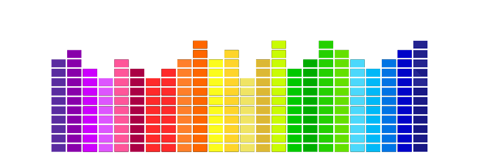
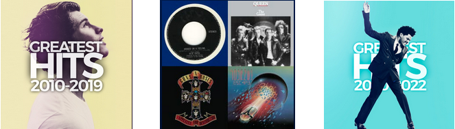

# Spotify Song Recommender

Fernando Borrero Granell

### Index:

* [Introduction](#section1)
* [Materials and Methods](#section2)
* [Linear Regression Model](#section5)
* [Logistic Regression Model](#section6)
* [Conclusion](#section7)
* [Physical units of the variables in the dataset](#section8)
* [Files](#section9)
* [References](#section10)
* [License](#section11)

### Introduction

In this project, I am working as a data analyst for a multicultural website. My company used Machine Learning to cluster +90.000 songs by their audio features.  The main objective of the project is to develop a song recommender that works in two ways: 1) if your input record is in the current top-100 charts, the system will recommend a similar song (from the same artist or genre) from the top-100, or 2) If your input record is NOT in the current HOT-100 charts, the system will recommend a similar song by downloading the audio features from the record and finding a song from the same cluster. 

### Materials and Methods

Instead of reading one TOP-100 songs chart from a single country, we read the TOP-100 from every country and extract from them all the unique songs through webscraping. In regards to the audio features, they were extracted from Spotify's API and consist of following parameters:  <em>danceability, energy, key, loudness, mode, speechiness, acousticness, instrumentalness, liveness, valence </em> and  <em>tempo</em>. The dataset of records was created through a scan of several playlists (<a href="https://open.spotify.com/playlist/1638KZlvcvyyEJ15S8erge">Greatest Hits 2020/2022</a>,
<a href="https://open.spotify.com/playlist/6Pi3jayiuzwmA5i6tLtIap">Greatest Hits 2010/2019</a>,
<a href="https://open.spotify.com/playlist/6FKDzNYZ8IW1pvYVF4zUN2">Longest Playlist Ever</a>), and extracting all of the songs of the albums that appear at least once in a playlist (including songs that may not appear in the playlist). 

  

The methods of this study include the followings:
* Webscrapping
* Use of Spotify's API
* Data wrangling
* ML: Unsupervised Learning
* Hyperparameter optimization
* Data visualization

### Results

Even though musical taste is something pretty subjective, we can see that the model is working as expected at recommending similar songs. Some examples are:

| Input                          	| Recommendation                     	|
|--------------------------------	|------------------------------------	|
| Ribs (by Lorde)                	| Isabel (by The Wombats)            	|
| Listzomania (by  Phoenix)      	| Out of Reach (by The Primitives)   	|
| After Midnight (by  Blink-182) 	| Scribble (by Puppet, Eden Project) 	|
| La Persona (by Amaia)          	| It's Love (by Kina Grannis)        	|

### References
The TOP-100 song charts were taken from the <a href="https://www.popvortex.com/music/">PopVortex</a> website. The data and audio features for all songs were obtained through the use of Spotify's API.

### License
This is an educational project; therefore, all materials can be used freelly.
